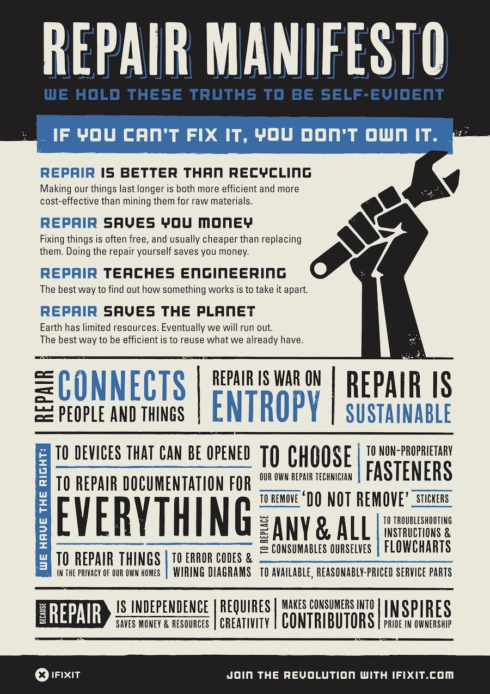

In the fourth grade I made my own Halloween costume: a garbage bag. That was how some saw it, at least. I'm not sure what I had in my head -- perhaps a paper warrior, or a recycling king? Either way, to make it I cut out a brown lunch bag as a helmet, taped an array of A4 sheets on my back, and held a long cardboard roll as a staff to parade around the streets of St. John's Wood.

This is an (albeit disappointing) example of what a Do It Yourself (DIY) attitude can produce. Others include DIY Soylent, the GNU Linux operating system, and Mahatma Gandhi's khadi. In short, works of utmost beauty.

You may laugh -- because we all know that isn't quite true. Linux isn't quite as smooth as Mac OS, and any Indian liberationist would acknowledge Gandhi could've been better dressed. The point of DIY, however, isn't perfection. It's the autonomy, mastery, and ownership you have over the final product. When I made that Halloween costume in fourth grade, people laughed at me, and it had some flaws. But it was mine, and no one could take that away*.

Fortunately this ethic is not just another one of my crack-pot ideas. The feelings brewing in my pre-adolescent youth have been codified in the Repair Manifesto, which I recently saw on my landlord's shed. "We hold these truths to be self-evident," it begins. "If you can't fix it, you don't own it."

 

I confess this Manifesto mentions many things I was not completely conscious of when I assembled my "garbage bag" costume. When we repair any type of gadget or doohickey, the benefit for the earth is three-fold: you don't throw out the gadget you have, you save on the materials needed to create another gadget, and you don't produce wasteful by-products created through the gadget's supply chain. Of course, over time you also save money (I've found this to be true after I started cutting my own hair), you gain independence from industries, and you learn some engineering skills you can easily practice in the future.

By now, you're probably sold, so let me take this a little further. What if the Do It Yourself attitude was carried through everything: our homes, our streets, our politics. If you don't like what your local Mayor or Councilmember is doing, do it yourself! If you don't like how your trash is being taken out, do it yourself! If you don't like how the dishes are being done, do it yourself!

Yes, this mantra asks a lot of you. But there's a lot to fix in this day and age -- and we need you to take up the wrench and make things better. 

* My DIY ethic for Halloween costumes -- you may be pleased to know -- has continued past lower school. In tenth grade I dressed up as my physics teacher and won the "scariest costume prize" in the high school; in freshmen year of college I did a similar impersonation of my math professor (for that, no prize was received except a confused expression on his face.)
